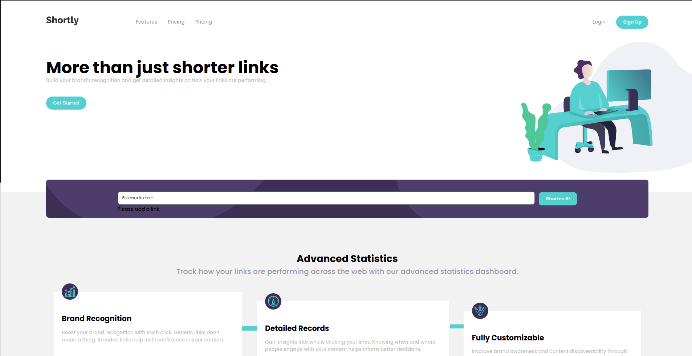

### Shortly URL shortening API Challenge

## About The Project

This project is a chalange from [Front end Mentor](https://www.frontendmentor.io), the challenge was build out this landing page, integrate with the [shrtcode API](https://app.shrtco.de/) and get it looking as close to the design as possible.

The users should be able to:

- View the optimal layout for the site depending on their device's screen size
- Shorten any valid URL
- See a list of their shortened links, even after refreshing the browser
- Copy the shortened link to their clipboard in a single click
- Receive an error message when the `form` is submitted if:
  - The `input` field is empty
### Built With

* [React.js](https://reactjs.org/)
* [shrtcode API](https://app.shrtco.de/)
* [SASS](https://sass-lang.com/)
* [Node.js](https://nodejs.org/en/)
* [Figma](https://www.figma.com/)
## Contact

Nicolas Johns - [Linkedin](https://www.linkedin.com/in/nicolas-js/) - nicolas-sousa2011@hotmail.com

Project Link: [repo-link](https://cryptouniverse.herokuapp.com/)

## Acknowledgments
* [shrtcode API](https://app.shrtco.de/)
* [Heroku](https://dashboard.heroku.com/apps)
* [Google Fonts](https://fonts.google.com/)